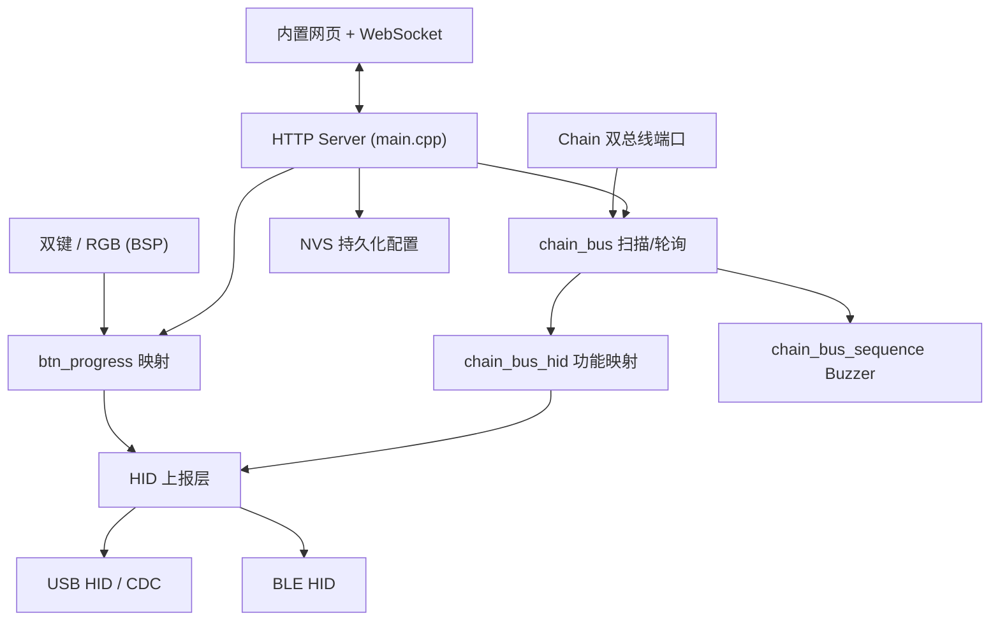

# AGENTS.md — Chain DualKey 出厂固件工程

本文件为 AI 编码助手 / 协作开发者提供该工程的整体认知、目录导航、构建方式与开发约定。阅读本文件后应能快速定位代码并安全地做出修改。

## 1. 项目概述

- **产品名称**: Chain DualKey（SKU: C147），M5Stack Chain 系列可扩展开发板。
- **主控**: ESP32-S3FN8（8MB Flash），target = `esp32s3`。
- **构建框架**: ESP-IDF **5.5.1**。
- **本仓库定位**: 出厂固件（Factory Firmware / UserDemo），即设备开箱即用的宏键盘固件。
- **硬件特性**: 2 个热插拔机械键轴 + 2 个可编程 RGB LED（WS2812），内置 350mAh 锂电池，2 个 HY2.0-4P Chain 扩展口，支持 USB-OTG。
- **核心功能**: 上电后作为 HID 输入设备工作，支持 **USB HID / BLE HID / USB CDC** 三种上报方式；设备开启 WiFi AP 热点，用户通过内置网页（WebSocket）配置本机双键及 Chain 扩展节点的 HID 功能映射。
- **官方文档**: https://docs.m5stack.com/en/chain/Chain_DualKey
- **License**: MIT（见 `LICENSE`）。

## 2. 目录结构

```
M5DualKey-UserDemo/
├── CMakeLists.txt              # 顶层 IDF 工程入口 (project: M5DualKey-UserDemo)
├── partitions.csv              # 自定义分区表 (含加密的 esp_secure_cert / nvs_key)
├── sdkconfig.defaults          # 关键 defconfig (target/BT/USB/PM/矩阵参数)
├── dependencies.lock           # 组件管理器锁定文件
├── main/                       # 应用主体 (业务逻辑集中在此)
├── components/                 # 本地组件 (随仓库维护)
│   ├── esp_duo/                # 板级支持包 BSP (引脚/键盘/WS2812/ADC/RGB矩阵)
│   ├── esp_hid/                # ESP HID 协议栈组件 (含本地 BLE HIDD 补丁)
│   ├── keyboard_button/        # 键盘矩阵扫描组件
│   └── m5chain/                # M5Chain 总线库 (各 Chain 设备驱动 + Arduino 示例)
├── managed_components/         # 组件管理器拉取的第三方组件 (勿手改)
│   ├── espressif__tinyusb/
│   └── espressif__led_indicator/
├── .github/workflows/          # CI: clang-format-check
├── .clang-format               # 代码风格 (格式化基准)
└── build/                      # 构建产物 (git 忽略)
```

### `main/` 内部模块

| 路径 | 职责 |
|------|------|
| `main.cpp` | 程序入口 `app_main`，约 2200 行。负责初始化全部子系统、WiFi AP/STA、HTTP+WebSocket 服务器、设备状态聚合、DualKey 与 WiFi 配置的 NVS 存取。 |
| `btn_progress.c` / `include/btn_progress.h` | 本机双键的按键处理与上报逻辑；预设 keymap 映射 + 自定义映射（单键/组合键/文本）；`btn_report_type_t`（USB/BLE/CDC/ALL）。 |
| `dual_button.c` / `include/dual_button.h` | 双按钮设备抽象（`iot_button` 扩展）。 |
| `settings.c` / `include/settings.h` | 系统参数（`report_type`）的 NVS 读写。 |
| `adc_detect.c` / `include/adc_detect.h` | 电池电压/充电状态/USB 电压检测，暴露全局 `g_battery_*`、`g_usb_*`。 |
| `ble/ble_hid.*`, `ble/esp_hid_gap.*` | BLE HID 设备（广播、连接、电量上报、键盘/鼠标报告）。 |
| `usb/tinyusb_hid.*`, `usb/tinyusb_cdc.*`, `usb/usb_descriptors.*`, `usb/tusb_config.h` | 基于 TinyUSB 的 USB HID 与 CDC 实现、USB 描述符。 |
| `chain_bus/chain_bus.*` | Chain 总线核心：扫描/轮询/事件检查、设备状态表 `bus_status[2]`（双总线）、Mono/RGB 像素缓冲、执行器控制 API。 |
| `chain_bus/chain_bus_hid.*` | Chain 节点的 HID 功能映射表 `hid_func_type_t`（键盘/鼠标/音量/媒体/摇杆 WASD·方向键）与触发接口；含 `mouse_hub` 平滑任务与 `chain_bus_hid_send_mouse_delta()` 直发接口。 |
| `chain_bus/chain_bus_sequence.*` | Buzzer 旋律序列播放（内置预设 Mario/Doorbell/Scale/Alarm）、`buzzer_seq_play` / `buzzer_seq_stop` 任务。 |
| `chain_bus/chain_bus_config.*` | Chain 节点按 UID 持久化 HID 配置到 NVS。 |
| `web/` | 内置配置网页：`index.html` / `styles.css` / `script.js` / `favicon.ico` / Chain 设备图片（`*.png`/`*.jpg` 由 CMake GLOB 嵌入），中英双语 `LanguageManager`。 |
| `Kconfig.projbuild` | 工程菜单：USB VID/PID/厂商/产品名、Light Sleep 超时。 |

## 3. 运行时架构

启动流程（`app_main`，见 `main/main.cpp`）：

1. 创建状态刷新队列 `status_refresh_queue`，初始化 NVS。
2. 读取系统参数 `settings_read_parameter_from_nvs()`。
3. 初始化 ADC（拨码开关检测 + 充电监测），启动 `adc_switch_task`。
4. 初始化 WS2812 LED、Chain 总线 `chain_bus_init()`、RGB 矩阵。
5. 初始化键盘扫描 `bsp_keyboard_init` 并注册 `keyboard_cb`。
6. 初始化双按钮 `app_dual_button_init()`。
7. 启动 WiFi（`wifi_init_sta`，失败/未配置则回落到 AP 模式 `DualKey_mac` / `12345678`）。
8. 启动 HTTP 服务器与 WebSocket 状态任务 `websocket_task`。
9. 初始化 USB HID (`tinyusb_hid_init`) 与 BLE HID (`ble_hid_init`)。
10. 加载 DualKey 配置，主循环按电量变化推送 BLE 电量。



### WebSocket 配置协议

网页与固件通过 WebSocket 交互，消息为 JSON，字段 `type` 决定命令（处理逻辑集中在 `main.cpp` 的 `websocket_handler`，约 580 行起）。主要命令：

- 状态/枚举: `get_status`、`enumerate_bus`
- 本机双键: `set_rgb`、`set_hid_mapping`、`set_key_mapping_switch`、`set_custom_mapping`、`save_dualkey_config`、`load_dualkey_config`
- Chain 节点: `set_chain_rgb`、`set_chain_bus_rgb`、`set_device_hid_config`、`reset_device_hid_config`
- Chain 执行器: `buzzer_play`、`buzzer_seq_play`、`buzzer_seq_stop`、`buzzer_stop`、`mono_draw`/`mono_clear`/`mono_scroll`、`rgb_draw`/`rgb_clear`/`rgb_scroll`、`servo_set_angle`、`unitbus_i2c_scan`
- 蓝牙: `bluetooth_start_adv`、`bluetooth_disconnect`、`bluetooth_start_pairing`
- WiFi: `set_wifi_config`、`reset_wifi_config`

### Web 前端要点（`main/web/script.js`）

- **双语**: `LanguageManager` 维护 `zh`/`en` 字典；静态元素用 `data-i18n`，动态 Chain 设备面板通过 `initHIDFunctionOptions()` + `refreshDeviceContainers()` 重渲染。
- **HID 选项分组**: `hidFunctionOptions`（通用）、`JoystickHIDFunctionOptions`（摇杆 XY 轴，含 18 鼠标移动 / 36 WASD / 37 方向键）、`KeyHIDFunctionOptions`（按键类设备阈值映射）等；`getJoystickHIDFunctionName()` 专用于摇杆 XY 显示。
- **设备控制面板**: Buzzer 三 Tab（单音符 / 自定义音调 / 内置音效预设）；Mono/RGB 点阵 + 滚动 Tab（RGB 滚动独立颜色选择器）；摇杆/踏板/MIC/DLight/PIR 等独立 HID 配置模板。

## 4. 支持的 Chain 设备（v0.7）

由 `main/chain_bus/` 与 `components/m5chain/` 共同支持。设备类型码见 `README.md`：

| 设备 | Type Code | 能力 |
|------|-----------|------|
| Unit ChainBus | 0x0006 | I2C 扫描、状态显示 |
| Chain Pedal | 0x0008 | 按键/开关轮询、HID 映射 |
| Chain MIC | 0x000A | ADC 轮询、阈值事件、HID 映射 |
| Chain Buzzer | 0x000B | 单音符 / 自定义频率、内置音效序列（4 预设） |
| Unit 8Servos2Chain | 0x000C | 8 路舵机、电压读取 |
| Chain Mono | 0x000D | 8×8 单色点阵（主机侧 `pixel_buffer` 整帧刷新）、滚动文字 |
| Chain RGB | 0x000E | 8×8 RGB565 点阵（主机侧 `pixel_buffer`）、滚动文字 |
| Chain ENV | 0x000F | 温湿度（AHT20）、气压/海拔（SPA06，`spa_ok` 字段） |
| Chain IMU | 0x0010 | 加速度、陀螺仪、温度 |
| Chain DLight | 0x0011 | 照度传感器、高低阈值 HID |

另兼容早期设备：Encoder / Angle / Key / **Joystick** / ToF / Switch / PIR。

### Chain Joystick 专项说明

- **XY 轴 HID 功能**（`joystick_config.xy_move_func`）：`HID_FUNC_MOUSE_MOVE`(18)、`HID_FUNC_JOYSTICK_WASD`(36)、`HID_FUNC_JOYSTICK_ARROWS`(37)、滚轮/平移等；配置项 `xy_move_reverse` 控制轴向翻转（左 Bus 默认开启）。
- **鼠标手感调参**（`chain_bus.h`）：`JOYSTICK_MOUSE_DEADZONE`（死区，回中不发报告防弹回）、`JOYSTICK_MOUSE_DIVISOR`（速度除数，越小越快，3≈原始 `/3` 手感，默认 4）、`JOYSTICK_SCROLL_DIVISOR`（滚轮除数）。摇杆 5ms 快速轮询，死区外每帧经 `chain_bus_hid_send_mouse_delta()` 直发增量。
- **WASD/方向键**: `chain_bus_hid_update_joystick_keys()` 八方向扇区映射；Y 轴 `up = y > deadzone`，`down = y < -deadzone`。
- **BLE 注意**: 主机未订阅键盘 Report CCC 时，`components/esp_hid/src/ble_hidd.c` 对 Indicate 未就绪静默返回（避免日志刷屏）；WASD 需主机启用键盘 HID 订阅后才生效。

### Chain ENV 轮询

- AHT20/SPA06 读数使用 `CHAIN_BUS_ENV_TIMEOUT_MS`（400ms），勿用全局 50ms 超时。
- `communication_flag = aht_ok || spa_ok`；仅双传感器均失败才累计 `poll_fail_count`（ENV 需 5 次才标记离线，其他设备 3 次）。

## 5. 构建与烧录

需先安装并 `source` ESP-IDF **5.5.1** 环境（`IDF_PATH` 有效）。

```bash
# 设定目标芯片 (仅首次)
idf.py set-target esp32s3

# 编译
idf.py build

# 烧录并查看串口日志 (替换端口)
idf.py -p /dev/ttyACM0 flash monitor
```

- 分区表为自定义（`partitions.csv`），含 **加密分区**（`esp_secure_cert`、`nvs_key`）。修改分区或安全配置时务必谨慎，可能影响出厂加密特性。
- Web 资源改动后需重新 `build`（`main/CMakeLists.txt` 的 `EMBED_FILES` 嵌入 html/css/js/ico 及 `web/*.png`、`web/*.jpg`）。
- 若构建报缺失已删除的 web 图片，执行 `idf.py fullclean && idf.py build` 清除陈旧 ninja 依赖。
- 关键 sdkconfig（见 `sdkconfig.defaults`）：`CONFIG_BT_ENABLED`、`CONFIG_HTTPD_WS_SUPPORT`、`CONFIG_PM_ENABLE`（低功耗）、`CONFIG_MATRIX_COLS=2`、`CONFIG_MATRIX_LED_COUNT=2`。

## 6. 依赖

组件管理器依赖见 `main/idf_component.yml`：

- `espressif/led_indicator ^1.0.0`
- `espressif/tinyusb ^0.18.0~2`
- `button >=4.0.0`

外部库：[M5Chain](https://github.com/m5stack/M5Chain)（本地已内置于 `components/m5chain/`）。

## 7. 开发约定

- **代码风格**: 遵循根目录 `.clang-format`；CI（`.github/workflows/clang-format-check.yml`）会做格式检查，提交前请运行 `clang-format`。
- **语言**: 固件为 C/C++ 混合，`main.cpp` 用 `extern "C"` 包裹 IDF 头文件；新增 C 接口需加 `#ifdef __cplusplus extern "C"` 保护。
- **注释**: 现有代码含大量中文注释，可延续；避免无意义的“翻译式”注释。
- **配置持久化**: 所有用户配置（DualKey、WiFi、Chain 节点 HID）均带 **CRC32 校验**后存 NVS，修改结构体时需同步更新 CRC 计算与版本兼容处理。
- **不要手动修改** `managed_components/`（由组件管理器生成）与 `build/`（构建产物）。
- **Chain 设备驱动新增**: 在 `components/m5chain/src/` 增加设备类，在 `main/chain_bus/chain_bus.*` 中登记类型、数据联合体成员与轮询/事件逻辑，必要时在 `chain_bus_hid` 增加映射，并在 `web/script.js` 增加前端 UI 与 i18n key。
- **摇杆鼠标调参**: 仅改 `chain_bus.h` 中 `JOYSTICK_MOUSE_DIVISOR` 等宏，勿在 `chain_bus.cpp` 使用易截断为 0 的 ad-hoc 除法；死区外必须保证至少 1px 增量。
- **Mono/RGB 绘点**: 维护主机侧 `pixel_buffer`，仅首次进入 PIXEL 模式，之后 `buffer_refresh` 整帧下发；`clear` 同步清零缓冲。
- **Web i18n**: 新增 UI 文案必须同时加入 `LanguageManager` 的 `zh`/`en` 字典，动态面板用 `languageManager.getText()`，勿硬编码中文。
- **文件操作**: `.pen` 设计文件受加密保护，仅可通过 Pencil MCP 工具访问；本工程一般不涉及。

## 8. 关键文件速查

- 应用入口 / WebSocket / HTTP：[main/main.cpp](main/main.cpp)
- 本机双键映射：[main/btn_progress.c](main/btn_progress.c)、[main/include/btn_progress.h](main/include/btn_progress.h)
- Chain 总线核心：[main/chain_bus/chain_bus.h](main/chain_bus/chain_bus.h)、[main/chain_bus/chain_bus.cpp](main/chain_bus/chain_bus.cpp)
- Chain HID 映射：[main/chain_bus/chain_bus_hid.h](main/chain_bus/chain_bus_hid.h)、[main/chain_bus/chain_bus_hid.cpp](main/chain_bus/chain_bus_hid.cpp)
- Buzzer 序列：[main/chain_bus/chain_bus_sequence.h](main/chain_bus/chain_bus_sequence.h)、[main/chain_bus/chain_bus_sequence.cpp](main/chain_bus/chain_bus_sequence.cpp)
- 配置持久化：[main/chain_bus/chain_bus_config.h](main/chain_bus/chain_bus_config.h)、[main/settings.c](main/settings.c)
- Web 前端：[main/web/script.js](main/web/script.js)、[main/web/styles.css](main/web/styles.css)
- BLE HID（本地）：[main/ble/ble_hid.c](main/ble/ble_hid.c)、[components/esp_hid/src/ble_hidd.c](components/esp_hid/src/ble_hidd.c)
- BSP：[components/esp_duo/include/bsp/esp_duo.h](components/esp_duo/include/bsp/esp_duo.h)
- M5Chain 库：[components/m5chain/src/M5Chain.h](components/m5chain/src/M5Chain.h)
- Buzzer 音符参考：[components/m5chain/examples/Buzzer_Example/NotePlayMode/NotePlayMode.ino](components/m5chain/examples/Buzzer_Example/NotePlayMode/NotePlayMode.ino)
- 构建配置：[CMakeLists.txt](CMakeLists.txt)、[main/CMakeLists.txt](main/CMakeLists.txt)、[sdkconfig.defaults](sdkconfig.defaults)、[partitions.csv](partitions.csv)
